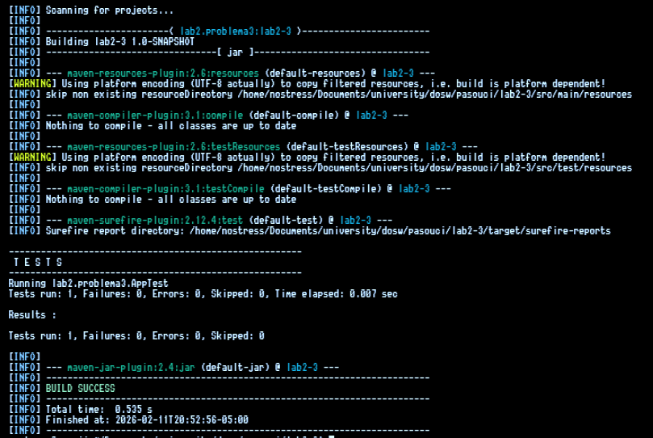
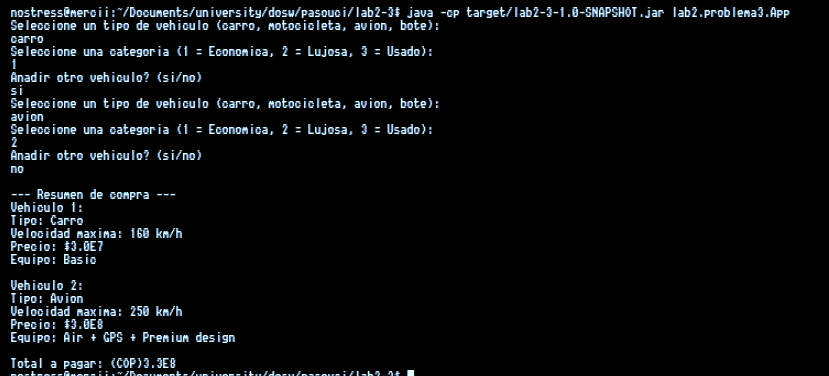

# DOSW Lab 2 - Retos 1 y 2

## Integrantes
- Gina Sofia Garcia Zapata
- Juan Diego Patino Munoz

## Sobre el reto

**Patrones usados**: Factory method, Strategy

**Justificacion**: El factory lo usamos para centralizar la creacion de diferentes tipos de vehiculos sin crear directamente
un objecto de X vehiculo en cualquier clase, con esto podemos crear en cualquier momento cualquier tipo de carro y centralizar
su creacion en la factoria.

Por otro lado el strategy lo usamos para encapsular el comportamiento de las categorias de
los vehiculos (economico, lujo, usado), de esta manera evitamos usar condicionales super
largos tambien nos ayuda en el hecho de que podemos modificar clases existentes de vehiculos
de una manera facil

---

**Como fue aplicado**: 
El factory fue aplicado mediante el VehiculeFactory, la cual permite la creacion dinamica de vehiculos indicando
la categoria y el tipo a crear.

El strategy fue implementado mediante la interfaz Category y sus implementaciones concretas (Economic, Luxury y Used),
cada una modifica los atributos para cumplir con los requisitos

---

